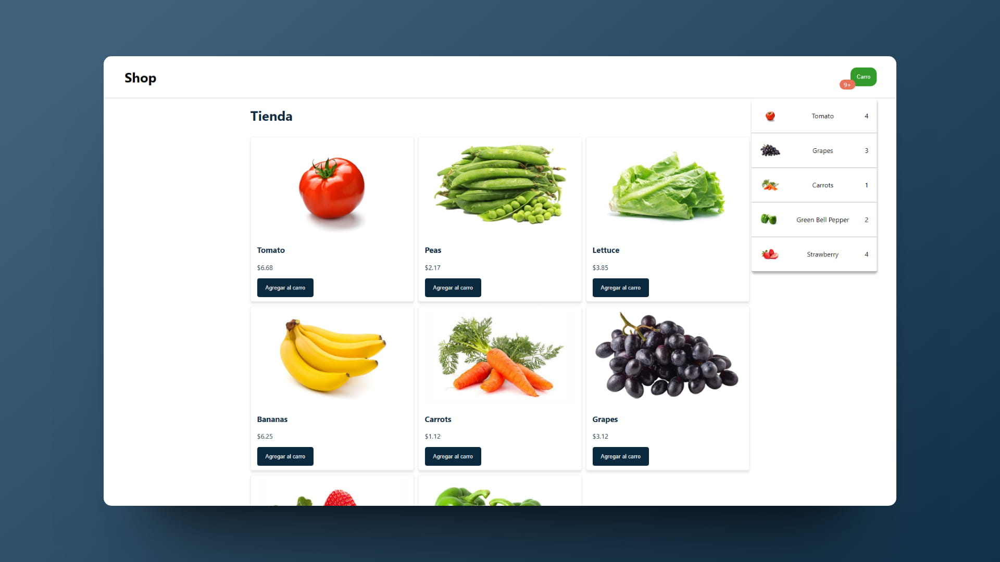

# 🛒 React: Shopping cart

### Carrito de compras

> 🧩 Aquí puedes ver su [**Live Demo.**](https://carrito-compras-abraham.netlify.app/)

## 🚀 Descripción

Este proyecto es una implementación de una tienda con **carrito de compras.**

## 🎭 Tecnologías

El proyecto utiliza las siguientes tecnologías:

- [**Vite**](https://vitejs.dev/) como empaquetador.
- Componentes basados en **clases** de React.
- Renderizado **condicional.**
