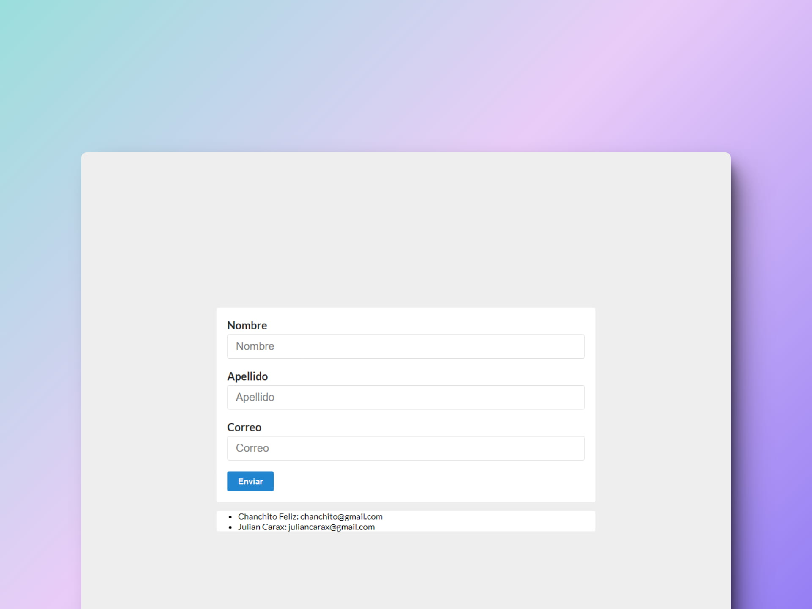

# 🧾 React: User Manager

### Gestor de usuarios

> 🧩 Aquí puedes ver su [**Live Demo.**](https://gestor-de-usuarios-abraham.netlify.app/)

## 🚀 Descripción

Este proyecto es una implementación de un **gestor de usuarios.** Para poner en práctica el manejo de formularios con React.

## 🎭 Tecnologías

El proyecto utiliza las siguientes tecnologías:

- [**Vite**](https://vitejs.dev/) como empaquetador.
- Componentes **funcionales.**
- **Custom hooks** para crear un objeto que almacene los usuarios registrados.
