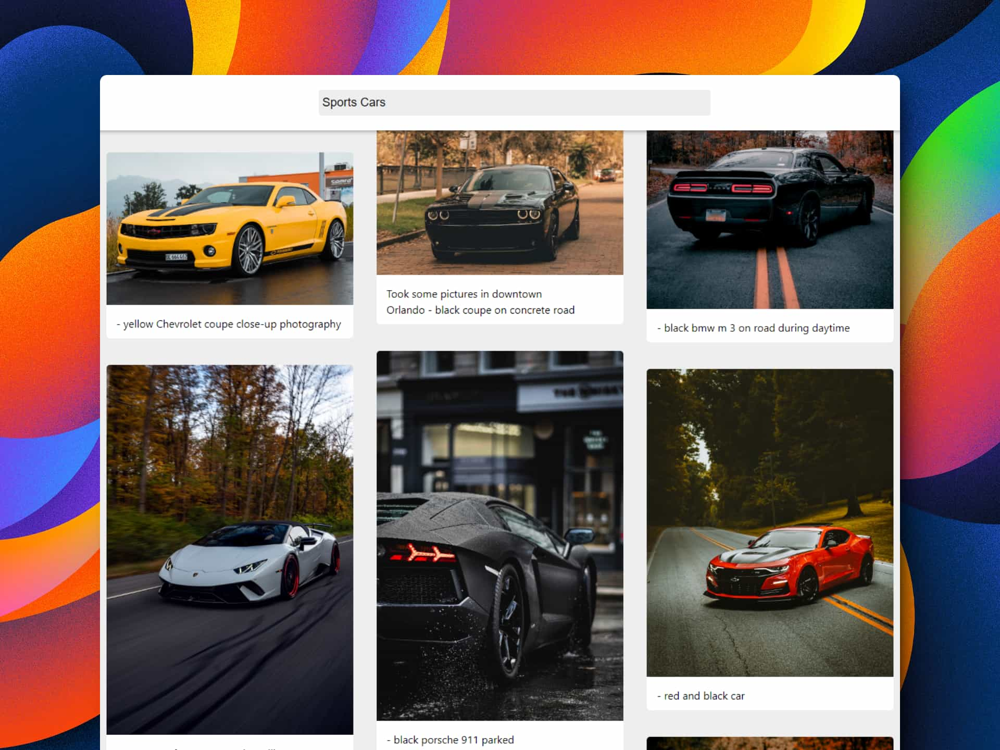

# 📷 React: Image search

### Buscador de imágenes

> 🧩 Aquí puedes ver su [**Live Demo.**](https://buscador-de-imagenes-abraham.netlify.app/)

## 🚀 Descripción

Este es un **buscador de Imágenes** que trae imágenes de la API de desarrolladores de **Unsplash.**

## 🎭 Tecnologías

El proyecto utiliza las siguientes tecnologías:

- [**Vite**](https://vitejs.dev/) como empaquetador.
- [**Masonry grid layout**](https://developer.mozilla.org/en-US/docs/Web/CSS/CSS_grid_layout/Masonry_layout) para mostrar las imágenes de búsquedas con solo **CSS** **sin utilizar JavaScript.**
- [**Formik**](https://formik.org/) para crear el formulario y hacer el **fetch** de datos.
