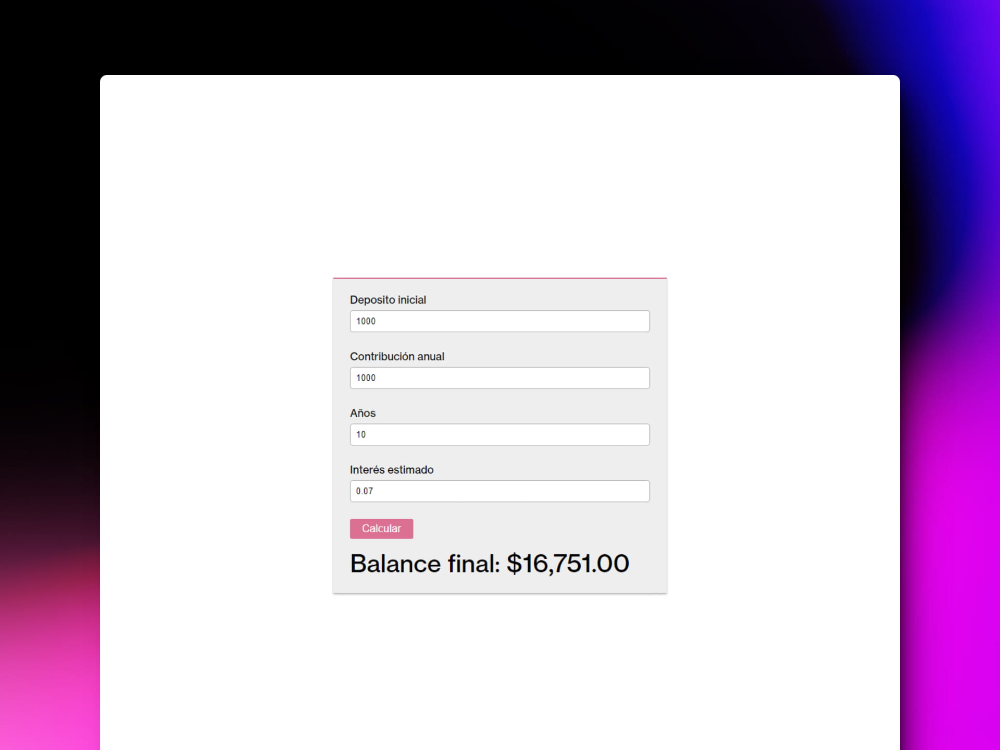

# 💰 React: Compound Interest Calculator

### Interés compuesto

> 🧩 Aquí puedes ver su [**Live Demo.**](https://interes-compuesto-abraham.netlify.app/)

## 🚀 Descripción

Esta es una **Calculadora de interés compuesto.**

## 🎭 Tecnologías

El proyecto utiliza las siguientes tecnologías:

- [**Vite**](https://vitejs.dev/) como empaquetador.
- [**styled-componets**](https://styled-components.com/) para crear los estilos.
- [**Formik**](https://formik.org/) para crear el formulario y hacer el **fetch** de datos.
- [**Yup**](https://www.npmjs.com/package/yup) para validaciones de formularios.
