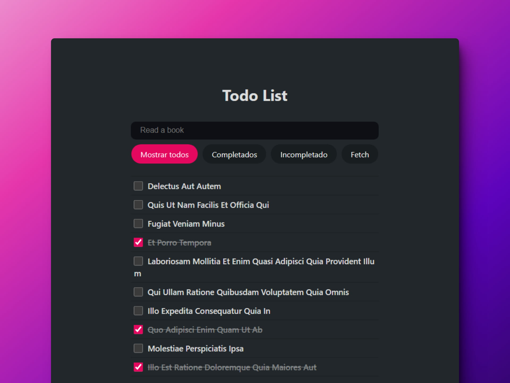
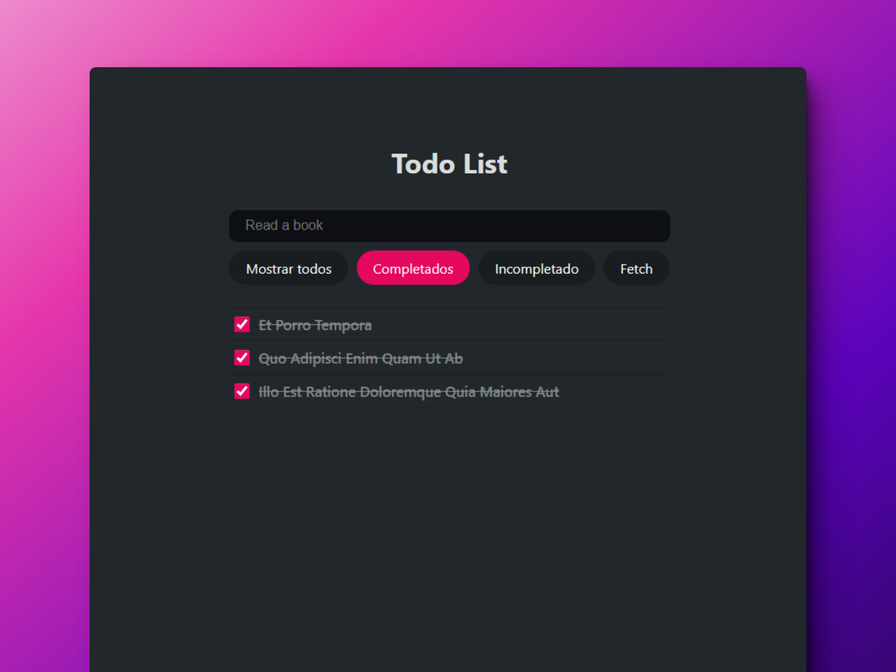
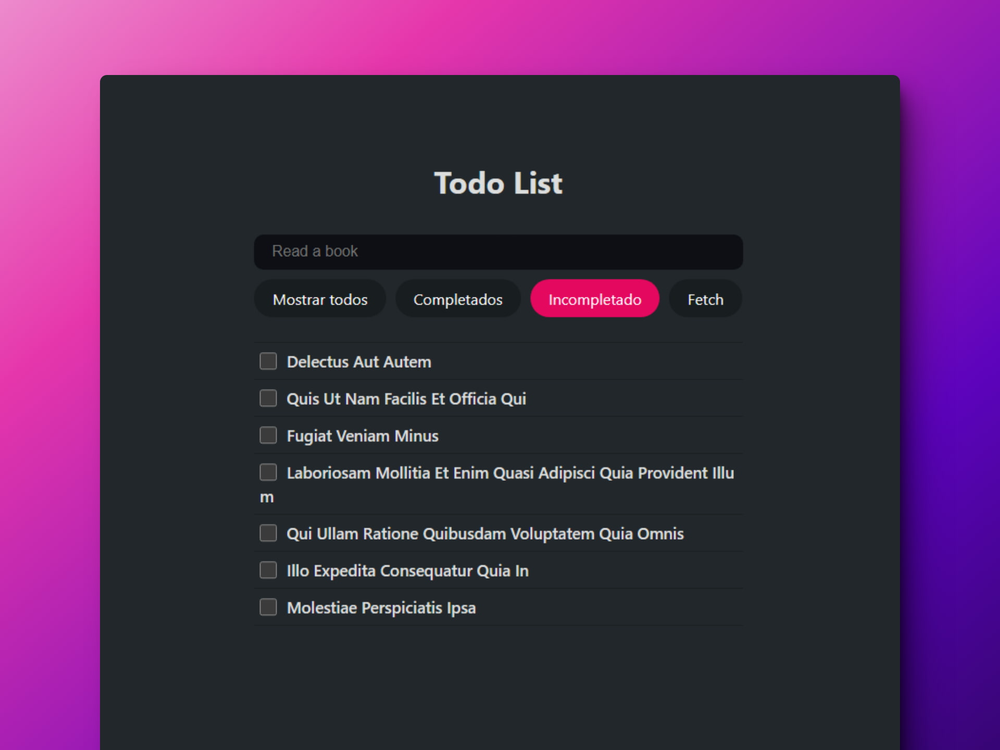

# 📄 React: Task list

### Lista de tareas

> 🧩 Aquí puedes ver su [**Live Demo.**](https://lista-tareas-abrahamgalue.netlify.app/)

## 🚀 Descripción

Esta es una aplicación de **Listas de tareas.**

## 🎭 Tecnologías

El proyecto utiliza las siguientes tecnologías:

- [**Vite**](https://vitejs.dev/) como empaquetador.
- [**Redux**](https://redux.js.org/) para definir el estado de la aplicación.
