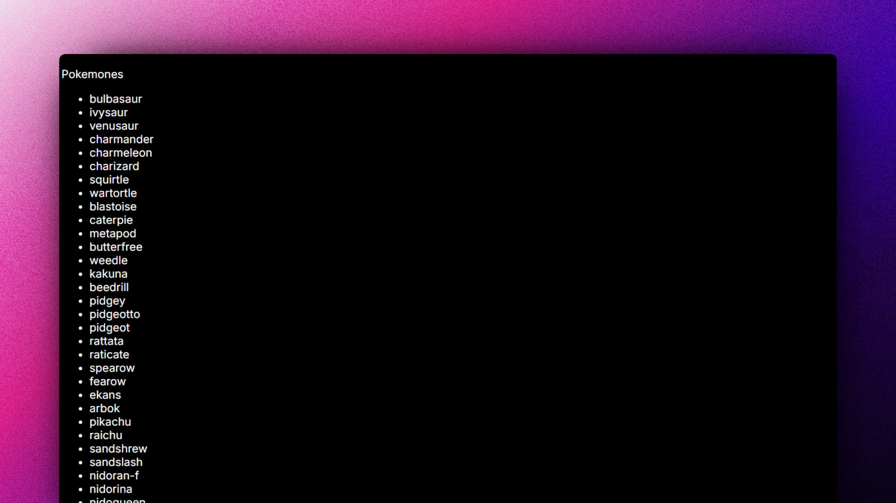
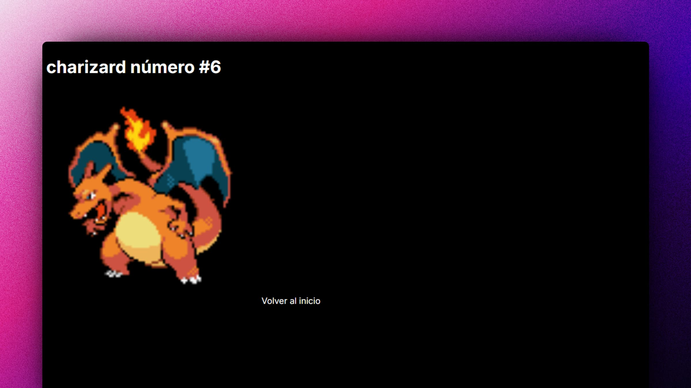

# 🐲 React: Pokemones

### Lista de Pokemones

> 🧩 Aquí puedes ver su [**Live Demo.**](https://next14-pokemones.vercel.app/)

## 🚀 Descripción

Esta es una aplicación de **Listas de Pokemones.** Utiliza Next 14, aplicando tecnologías como **SSR**, **SSG**, **Server Components** y **Client Components**, para renderizar los datos. Además se aplica testing.

## 🎭 Tecnologías

El proyecto utiliza las siguientes tecnologías:

- [**Next**](https://nextjs.org/) como framework.
- [**Styled Components**](https://styled-components.com/) para integrarlo con Nextjs.
- [**React Testing Library**](https://testing-library.com/docs/react-testing-library/intro/) para renderizar los componentes con React.
- [**Jest**](https://jestjs.io/) para realizar los tests unitarios.